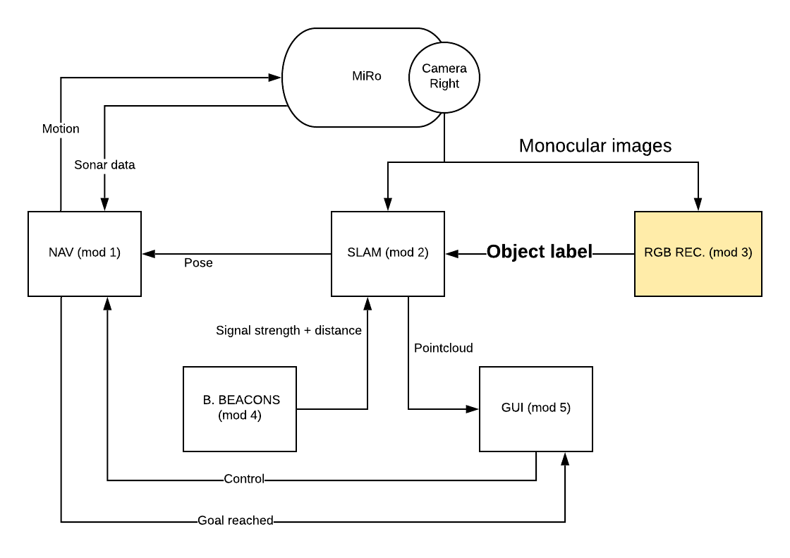

# SOFAR-project
## Objective of the Project: Constructing and navigating through a topological SLAM map
The overall project is tilted ”Constructing and navigating through a topological SLAM map”. The objective was to develop a software architecture for a social mobile robot to achieve the desired objectives of both enable the robot to navigate and explore the environment and at the same time to merge objects informations, provided by multiple perception systems.
The platform exploited for the project it has been the ROS-supported mobile robot  MiRo,  engineered  by  the  company  Consequential  Robotics. 
Inparticular,  MiRo-b  is  defined  as  a  fully  programmable  autonomous  robot  for researchers, educators, developers and healthcare professionals. It has six senses,eight degrees of freedom, an innovative brain-inspired operating system and a simulation software package.
The project has been developed in the occasion of the course Software Architecture for Robotics which is part of the M.Sc. track on Robotics Engineering held at the Univerity of Genoa.
## Architecture of the entire project
<p align="center"> 

</p>
The modules are 5 and are divided as follows:<br/><br/>
    1. Navigation: MiRo navigating through the environment with the help of a bug algorithm based on computer vision<br/>
    2. Monocular SLAM: Acquire depth information from monocular vision of the moving mobile robot.<br/>
    3 RGB based object recognition: Object recognition using machine learning tools.<br/>
    4. Bluetooth beacons based distance estimation. <br/>
    5. Interface between user and fused perception information:  GUI (Graphic User Interface).<br/><br/>

## Module 3: RGB based object recognition
The main goal of Module 3 is to enable Miro to detect and recognize objects and to retrieve their pose (i.e.  bounding boxes) as well as their names (i.e.  labels). For the purpose, a prettrained model has been exploited in the context of the Tensorflow framework and, in particular, the Tensorflow-Object Detection API. The model we have exploited is the SSD-mobilenet trained on the COCO dataset.

## Architecture of the system
<p align="center"> 

</p>
The architecture consists substantially of 2 ROS nodes:<br/><br/>
1. cob_people_object_detection_tensorflow<br/>
2. ir_adapter<br/><br/>
The first node exploiting the OpenCV library and the cv_bridge tool, in order to make such images ROS-compliant, process the visual information retrieved from the right camera of MiRo, by means of the topic /miro/sim01/platform/camr, and thanks to a detector which in turn leverages a pretrained neural network, built on top of the Tensorflow Object Detection API, detects and classify the objects in the scene and publishes to the topic /object_detection/detections which emebeds the information about the label, score and bouding box of the recognised object.<br/><br/>
Consequently, for we wanted to make the information available for the other modules constrained to a simple label in a publish / subscribe fashion, we have developed an adapter (ir_adapter node) which according to the score and the threshold set by the user eventually advertise the label as a string, e.g. chair, table, person, etc, on the topic /adapted_message.<br/>

## Installation and running
First, Tensorflow should be installed on your machine. See [reference guide](https://www.tensorflow.org/install/pip) (Tensorflow 1 has been adopted for the project).<br/>
After:<br/>

```
$ cd && mkdir -p catkin_ws/src && cd ..
$ catkin_make && cd src
$ git clone --recursive https://github.com/EmaroLab/ros_people_object_detection_tensorflow.git
$ cd cob_people_object_detection_tensorflow/src
$ protoc object_detection/protos/*.proto --python_out=.
$ cd ~/catkin_ws
$ rosdep install --from-path src/ -y -i
$ catkin_make
$ source ./devel/setup.bash
```
At this point it is possible to run our module by typing the command:<br/> ```roslaunch cob_people_object_detection_tensorflow cob_people_object_detection_tensorflow.launch```

Remark: you can set the parameters in the file 
```cob_people_object_detection_tensorflow_params.yaml ```

## Results
Below there is the demonstration video of our module on the mobile robot MiRo in the Gazebo simulator.<br/>
See the [Consequential Robotics website](http://labs.consequentialrobotics.com/) for the instruction on how to carry out simulation in Gazebo with MiRo.<br/><br/>
[](https://www.youtube.com/watch?v=Q-gqG0p4f_U&feature=youtu.be)<br/>

In prticular it has to be noticed that the /adapted_message topic is in the bottom right terminal window in the video recording.

## References and ackowledgements
The code is based on [this](https://github.com/cagbal/ros_people_object_detection_tensorflow) repository.<br/>
## Authors
| Name | E-mail |
|------|--------|
| Filippo Gandolfi | didi.gandolfi@gmail.com |
| Mario Ciranni | mario.ciranni@gmail.com |

