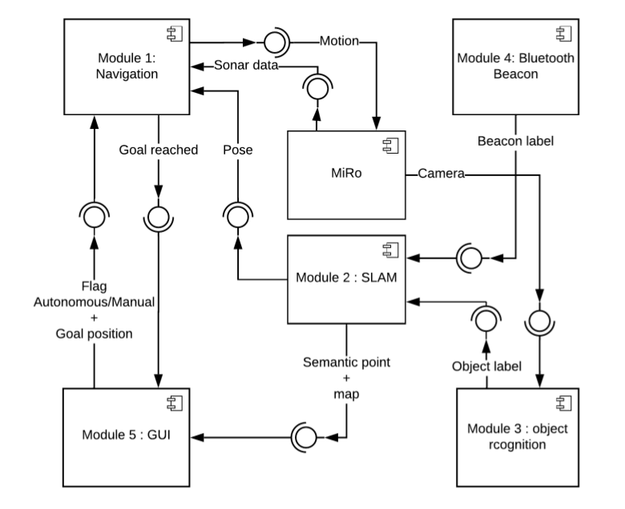
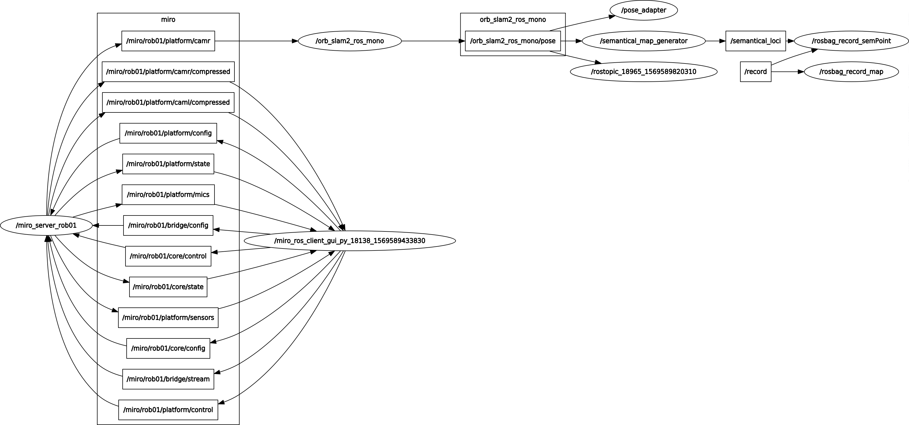
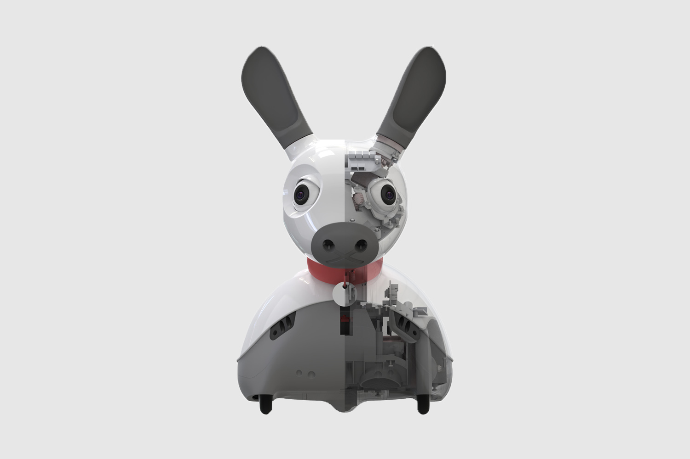

# Semantic ORB-SLAM

## GOAL
### The goal is to build a semantic ORB-SLAM map by navigating in an environment. It is also possible to load a previously constructed map and use it to reach specific position by taking advantage of the other modules developed in this project and shown in Figure.

<p align="center">
 
</p>

## CODE ARCHITECTURE
Our code architecture can be summarized with different nodes which exchange different data between them as shown in the following figure:

<p align="center">
 
</p>

A more detailed description about their structure and functionalities can be found in the PDF inside the repository.

## THE ROBOT
The robot used in this project is MIRO, developed by the [Consequential Robotics](http://consequentialrobotics.com/) and shown in the following:

<p align="center">
 
</p>

To be able to interact with it, the MDK folder needs to be downloaded and installed. The steps requested for doing that are described in the following links:
 - [Installation](http://labs.consequentialrobotics.com/miro-e/docs/index.php?page=Developer_Install_Steps_Install_MDK)

 - [Configuration](http://labs.consequentialrobotics.com/miro-e/docs/index.php?page=Developer_Install_Steps_Configure_MDK_Configure_Network)

### Prepare your environment
Moreover ROS and Gazebo are requested and the respective tutorial can be found in the following links:

 - [ROS](http://labs.consequentialrobotics.com/miro-e/docs/index.php?page=Developer_Install_Steps_Install_ROS)

 - [Gazebo](http://labs.consequentialrobotics.com/miro-e/docs/index.php?page=Developer_Install_Steps_Install_Gazebo)

## GETTING STARTED
### Download the .zip file correspondent to the workspace in the user home folder, then unzip the package folder and access it:
```
$ cd home/catkin_workspace_SOFAR_semantic_slam
```

### Source the environment:
```
$ source devel/setup.bash
```

```
$ source /opt/ros/kinetic/setup.bash
```

### Build the package:
```
$ catkin_make

##Connect your local machine to MIRO
Enter in MIRO via ssh.
Be sure you are under the same Network of MIRO.
```
$ ssh root@MIRO_IP
```

Enter the password provided with the robot.
Insert your local machine IP address in the file that will be opened once digited the following command:
```
$ sudo nano .profile
```

##Run ORB-SLAM node
In a sourced terminal start roscore by digiting:
```
$ roscore
```

Open a new terminal on your PC and source it with the following command:
```
$ source /home/catkin_workspace_SOFAR_semantic_slam/mdk/setup.bash
```

Then acces the following folder:
```
$ cd /home/catkin_workspace_SOFAR_semantic_slam/mdk/bin/shared
```

Run the GUI provided:
```
$ ./miro_ros_client_gui.py robot=rob01
```

The GUI allows the user to set some robot's parameters (i.e. position of the joints, fps, etc), to visualize what it is seeing, to make it moves and other functionalities.

Access in the workspace in a new terminal with the following:
```
$ cd /home/catkin_workspace_SOFAR_semantic_slam
```

Launch the ORB-SLAM node:
```
./launch.sh
```

Once this is done the robot starts to build an ORB-SLAM map also incorporating the semantical information coming from other modules and so constructing a semantical map.
