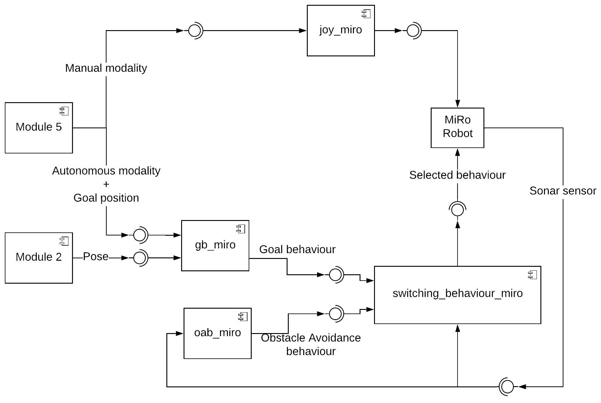

 # Navigation with MiRo Robot

 ## Module 1
 The main goal of module 1 is guiding MiRo with two different modalities: autonomous and manual.
 The autonomous one consists in reaching a goal position chosen by the user from the GUI (Module 5). The robot must be able to override the velocity command when an obstacle is detected in order to avoid collision with it.
 The manual modality consists in moving MiRo trough the environment with a PS4 joystick.
 This Project has been developed for the Software Architecture course of the master degree program in Robotics Engineering at University of Genoa.

 ### MiRo Robot of Consequential Robotics
 MiRo is a fully programmable autonomous robot for researchers, educators, developers and healthcare professionals. With six senses, eight   degrees of freedom, an innovative brain-inspired operating system and a simulation software package, MiRo is a flexible platform suited for developing companion robots.


 ### Autonomous modality
 
 In this modality there are two possible MiRo behaviours:
 * Goal behaviour
 * Obstacle Avoidance behaviour
 
 The **Goal behaviour** regards the robot's ability to reach a specific goal position with a tolerance of 0.1 meters. The user must insert the desired position from the GUI.
 Basically, it computes the distance and the steering angle which are needed to reach the goal and, depending on a constant, it sets MiRo's linear and angular velocities.

 The **Obstacle Avoidance behaviour** overrides the Goal behaviour when and obstacle is detected by using MiRo's sonar sensors.
 When an obstacle is detected MiRo starts turning by more than 90 degrees and moving forward to make sure to avoid the obstacle. It continues doing this until the obstacle is not detected anymore.
 Then the control of MiRo goes back to the previous behaviour.

 ### Manual modality

 In this modality the user can take control of MiRo's movements using a Ps4 joystick:
 * Moving along the vertical axis of the left stick the user is able to control MiRo's linear velocity
 * Moving along the horizontal axis of the right stick the user is able to control MiRo's angular velocity

 ## The implementation 

 Each section of the architecture from Module 1 has been implemented as a ROS node.

 A Publish/Subsciber messaging pattern is used for communication between the nodes.
<p align="center">
 
</p>

 The *gb_miro* node subscribes to '/actual_pose'  and 'module_5' topics to obtain the chosen navigation modality, MiRo's actual and goal position, than computes the distance, the steering angle and sets the velocities in order to publish a message of type platform_control on '/gb' topic.  

 The *oab_miro* node subscribes to '/platform/sensors' topic to detect the presence of an obstacle using sonar, and it publishes a message of type platform_control that contains MiRo's body velocities on '/oab' topic. 
 
 The *switching_behaviour* node subscribes to both '/gb' and '/oab' topics that correspond to the two different behaviours.
 Depending on the presence (or not) of an obstacle, it selects which behaviour the robot should perform and it publishes a message of type platform_control containing the velocities to the topic '/platform/control'.

 The *joy_miro* node subscibes to '/joy' topic to read data from the joystick and convert them into Twist commands, and it publishes a Twist message that contains MiRo's body velocities on '/control/cmd_vel' topic. 

 Our project aims to obtain a total scalability, in order to improve or replace each module without modifying any of the others. This way new behaviours can be easily added.
 
  **For more details see the report**
 ## Gettin Started

 ## Prerequisites

 ### ROS
This project is developed using [ROS](http://wiki.ros.org/kinetic/Installation/Ubuntu):
* rosdistro: kinetic
* rosversion: 1.12.13

 ### MiRo Workstation
Download the [Miro Developer kit](http://labs.consequentialrobotics.com/miro/mdk/).

Follow the instructions from Consequential Robotics [Miro: Prepare Workstation](https://consequential.bitbucket.io/Developer_Preparation_Prepare_workstation.html) to set up your workstation to work with MiRo. 
Strictly follow the instructions in the Install MDK section as the following steps will rely on this.

It is not necessary to make static IP for your workstation (laptop) while setting up connection with MiRo.

 ### Navigation

Create a catkin workspace and clone all the packages in the src folder

```
$ git clone https://github.com/.....
$ cd .....
$ catkin_make
$ source devel/setup.bash
```

 ### Manual Modality
Install ds4drv and other features to connect joystick with the pc.

```
$ sudo pip install ds4drv
$ sudo apt-get install ros-kinetic-joy
```

 Run ds4drv and connect the Bluetooth joystick by holding Share + the PS button until the LED starts blinking rapidly.

```
$ sudo ds4drv
```

 To publish the joystick data over ROS we need to start the 'joy_miro' node. First, you have to tell the 'joy_miro' node which joystick device to use, the default is js0. 

```
$ roscore
$ rosparam set joy-node/dev"dev/input/js0"
```

 ## How to run the project

 ### Manual modality
Open a new terminal and launch:

```
$ roscore
```

As you have already done for the installation run ds4drv and connect the Bluetooth joystick by holding Share + the PS button until the LED starts blinking rapidly.
In a new terminal run the following command:

```
$ ds4drv
```

In other terminal run the node to acquire the data from the joystick:

```
$ rosrun joy joy_node
```

In one last terminal run:

```
$ ./joy_miro.py
```

 ### Autonomous modality
The following command will start the modality:

```
$ roslaunch Module1 miro.launch
```


## Results
* Video Demo with a Real Miro.

[.


## Works based on the previous Project
* Guide MiRo using a wearable device through specific gestures.--> https://github.com/EmaroLab/GestureBasedControlMiro

## Acknowledgments

* [switching_behaviour](https://github.com/EmaroLab/GestureBasedControlMiro) 
* [oab_miro](https://github.com/EmaroLab/GestureBasedControlMiro) 
* [gb_miro](https://github.com/clebercoutof/turtlesim_cleaner)  ROS_Wiki


### Team
* Francesca Canale *francesca.canale.95@gmail.com*
* Marco Giordano *marcogiordano295@gmail.com*
