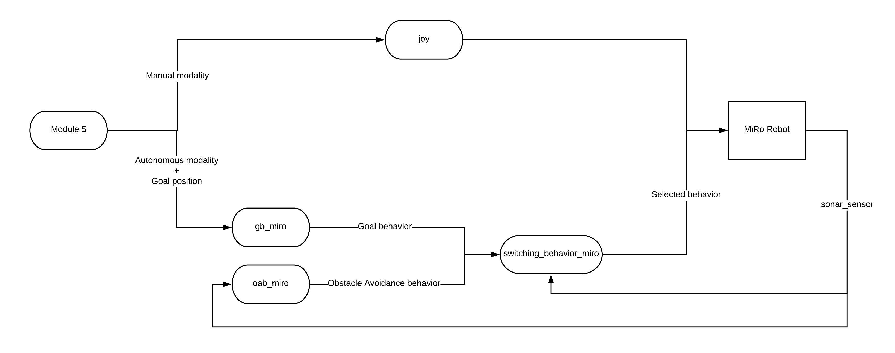

 # Navigation with MiRo Robot

 ## Module 1
 The main goal of module 1 is to guide MiRo with two different modalities: autonomous and manual.
 The autonomous one consists in reaching a goal position chosen by the user from module 5 (GUI). The robot must be able to override the velocity commands when an obstacle is detected in order to avoid collision with it.
 The manual modality consists in moving Miro around with a PS4 joystick.
 This Project has been developed for the Software Architecture course of the master degree program in Robotics Engineering at University of Genoa.

 ### MiRo Robot
 MiRo is a fully programmable autonomous robot for researchers, educators, developers and healthcare professionals. With six senses, eight   degrees of freedom, an innovative brain-inspired operating system and a simulation software package, MiRo is a flexible platform suited for developing companion robots.


 ### Autonomous modality
 
 In this modality there are two possible MiRo behaviors:
 * Goal behavior
 * Obstacle Avoidance behavior
 
 The **Goal behavior** regards the robot's ability to reach a specific goal position with a tollerance of 0.1 meters. The user must insert from the GUI the desired position.
 Basically, it computes the distance and the steering angle needed to reach the goal and, depending on a constant, it sets MiRo's linear and angular velocities.

 The **Obstacle Avoidance behavior** overrides the Goal behavior when and obstacle is detected by using MiRo's sonar sensors.
 When an obstacle is detected MiRo starts turning by more than 90 degrees and then it moves forward to make sure it actually avoids the obstacle. It continues doing this until the obstacle is not detected anymore.
 Then the control of MiRo goes back to the previous behaviour.

 ### Manual modality

 In this modality the user can take control of MiRo's movements using a Ps4 joystick:
 * Moving along the vertial axis of the left stick he can control MiRo's linear velocity
 * Moving along the horizontal axis of the right stick he can control MiRo's angular velocity

 ## The implementation 

 Each module which is part of the architecture has been implemented as a ROS node.

 For comunication between the nodes we use a Publish/Subscibe messaging pattern.
<p align="center">
 
</p>


 The *oab_miro* node subscibes to '/platform/sensors' topic to detect the presence of an obstacle using sonar, and it publishes a message of type platform_control that contains MiRo's body velocities on '/oab' topic. 
 
 The *switching_behavior* node subscribes to both '/gb' and '/oab' topics that correspond to the two different behaviors.
 Depending on the presence (or not) of an obstacle it selects which behavior to publish on the robot and the corespondent velocities.

 The *joy* node subscibes to '/joy' topic to read data from the joystick and convert them into Twist commands, and it publishes a Twist message that contains MiRo's body velocities on '/control/cmd_vel' topic. 

 Our project aims at total scalability, so each module can be improved or replaced without any changes on the others and new behaviours can be easily added. 
 
  **For more details see the report**
 # Gettin Started

 ## Prerequisites

 ### ROS
This project is developed using [ROS](http://wiki.ros.org/kinetic/Installation/Ubuntu):
* rosdistro: kinetic
* rosversion: 1.12.13

 ### MiRo Workstation Setup
Download the [Miro Developer kit](http://labs.consequentialrobotics.com/miro/mdk/).

Follow the instructions from Consequential Robotics [Miro: Prepare Workstation](https://consequential.bitbucket.io/Developer_Preparation_Prepare_workstation.html) to set up your workstation to work with MiRo. 
Strictly follow the instructions in the Install MDK section as the following steps will rely on this.

Not necessary to make static IP for your workstation (laptop) while setting up connection with MiRo.

Create a catkin workspace and clone all the packages in the src folder

```
$ git clone https://github.com/.....
$ cd .....
$ catkin_make
$ source devel/setup.bash
```

 Connect the Miro robot to the ROS Master

```
$ ssh root@<MIRO-IP> 
$ sudo nano ./profile
```
 Insert your IP after ROS_MASTER_IP

For more detailed instructions see [MIRO: Commission MIRO](https://consequential.bitbucket.io/Developer_Preparation_Commission_MIRO.html)

### Manual modality
 
 Install ds4drv and other features to connect joystick with the pc

```
$ sudo pip install ds4drv
$ sudo apt-get install ros-kinetic-joy
```

 Run ds4drv and connect the bluethoot joystick by holding Share + the PS button until the LED starts blinking rapidly.

 ```
$ sudo ds4drv
```
 To get the joystick data published over ROS we need to start the joy node. First let's tell the joy node which joystick device to use, the default is js0. 

```
$ roscore
$ rosparam set joy-node/dev"dev/input/js0"
```

 Then while Miro is connected run the nodes

 ```
$ rosrun joy joy_node
$ ./joy.py
```

### Autonomous modality

After the connection with MiRo the following commands will start the modality 

```
$ cd catkin_workspace_SOFAR_semantic_slam/src/Module1/src
$ oab_miro.py
```
In other terminals 

```
$ cd catkin_workspace_SOFAR_semantic_slam/src/Module1/src
$ switching_behavior.py
```

```
$ cd catkin_workspace_SOFAR_semantic_slam/src/Module1/src
$ gb_miro.py
```

## Results
* Video Demo with a Real Miro.

[.


## Works based on the previous Project
* Guide MiRo using a wearable device through specific gestures.--> https://github.com/EmaroLab/GestureBasedControlMiro

## Acknowledgments

* [switching_behavior](https://github.com/EmaroLab/GestureBasedControlMiro) 
* [oab_miro](https://github.com/EmaroLab/GestureBasedControlMiro) 
* [gb_miro](https://github.com/clebercoutof/turtlesim_cleaner)  ROS_Wiki


### Team
* Francesca Canale *francesca.canale.95@gmail.com*
* Marco Giordano *marcogiordano295@gmail.com*
